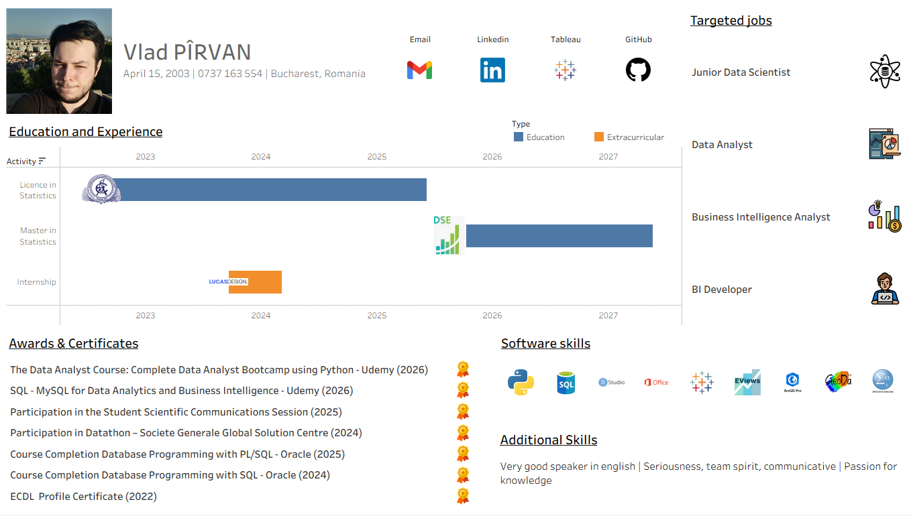

Interactive Career Portfolio | Vlad Pîrvan

Welcome to my repository! Here I present my skills in the field of data analysis

Here i created an interactive tool in Tableau that visualizes my experience, from my bachelor's degree in statistics to my current career goals.

**[👉 View the Dashboard on Tableau Public](https://public.tableau.com/app/profile/vlad.pirvan/viz/MyCV_17786741300100/Dashboard1)**

---

Technical Details 
In carrying out this project, I implemented solutions for the clearest possible visualization:

* **Dual Axis & Synchronization**: Synchronization of custom icons (Bucharest University of Economic Studies (ASE) and DSE (department from my master) with the timelines of the Gantt chart.
* **Custom Shapes**: Integrated custom logos to transform a classic table into a modern list of "Targeted Jobs".
* **Calculated Fields**: Created a calculated field to synchronize the icons with specified links. Developed a calculated field using the DATEDIFF function to determine the duration of each activity in days, enabling the precise scaling of Gantt bars along the timeline.

Repository Content
* **VladPIRVAN_CV.twbx**: The Tableau source file (Packaged Workbook) containing both the data and the visualization.
* **VladPIRVAN_CV_dashboard.png**: Picture of the dashboard.
* **my_data.xlsx**: The structured Excel dataset that I used as a base.

 Contact & Links
* **Tableau Public**: [My Profile](https://public.tableau.com/app/profile/vlad.pirvan/vizzes)
* **LinkedIn**: [Connect with me](https://www.linkedin.com/in/vlad-p%C3%AErvan-72b565244/)
* **Email**: [pirvanvlad0@gmail.com]
